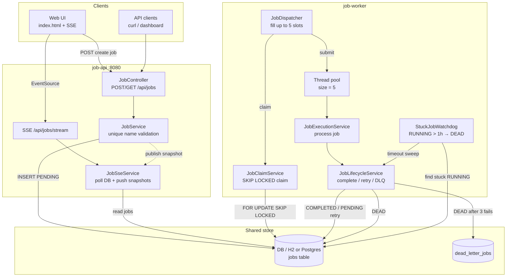
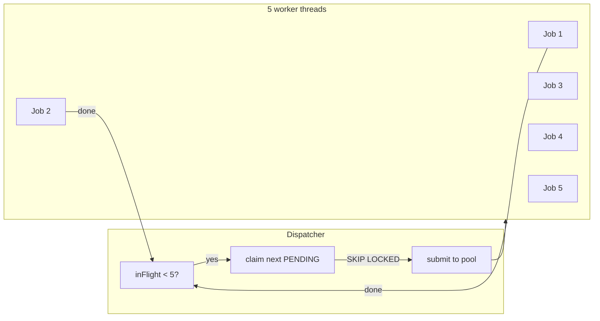
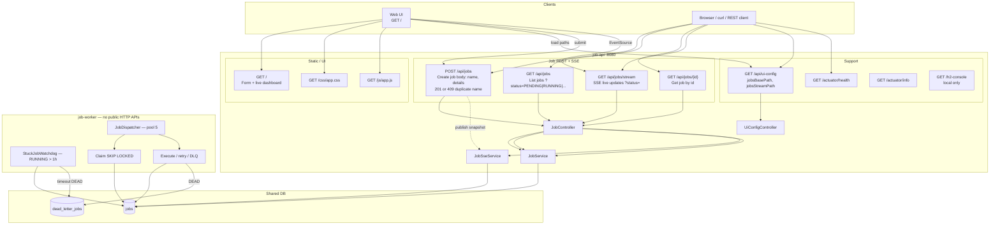
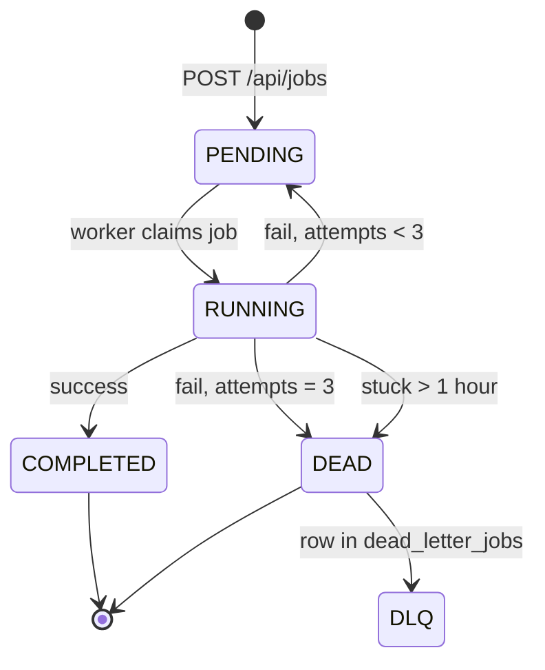
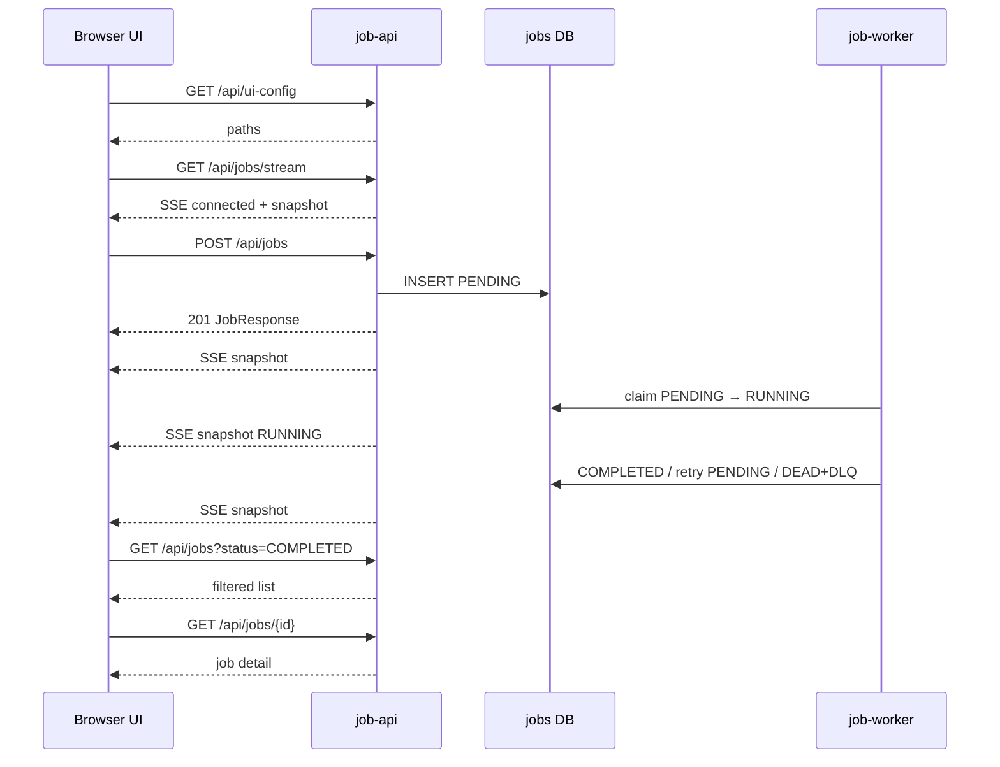

# Async Jobs (Spring Boot)

Deployable multi-module app: **job-api**, **job-worker**, shared **job-common**.

## System architecture

Two deployable services share one database. The API accepts jobs and streams status; the worker claims and processes them in parallel.



### Concurrency model



## Architecture with all APIs



### Job lifecycle



### Request flow



### API catalog (job-api)

| Method | Path | Purpose |
|--------|------|---------|
| `GET` | `/` | Form + dashboard UI |
| `GET` | `/css/app.css` | UI styles |
| `GET` | `/js/app.js` | UI logic |
| `GET` | `/api/ui-config` | Frontend path config |
| `POST` | `/api/jobs` | Create job `{ "name", "details" }` |
| `GET` | `/api/jobs` | List all jobs (optional `?status=`) |
| `GET` | `/api/jobs/{id}` | Get one job |
| `GET` | `/api/jobs/stream` | SSE live job snapshots (optional `?status=`) |
| `GET` | `/actuator/health` | Health check |
| `GET` | `/actuator/info` | App info |
| `GET` | `/h2-console` | H2 console (local profile only) |

**job-worker** exposes no public HTTP APIs (background processor only).

### Modules

| Module | Role |
|--------|------|
| `job-api` | Create/list/status APIs, SSE live dashboard, UI |
| `job-worker` | Parallel processing, retries, timeout → DLQ |
| `job-common` | Shared `Job`, status, repositories |

## Profiles

| Profile | Config files | Use |
|---------|--------------|-----|
| `local` (default) | `application.properties` + `application-local.properties` | H2 file DB |
| `production` | `application.properties` + `application-production.properties` | Postgres via env vars |

Configurable base path:

```properties
app.api.jobs-base-path=/api/jobs
```

Fixed under that base (do not change):

- `GET/POST /api/jobs`
- `GET /api/jobs/{id}`
- `GET /api/jobs/stream` (SSE)

## Run — local

First time (or after pulling changes), install shared module once from the parent folder:

```bash
cd /workspaces/async-jobs
./mvnw clean install -DskipTests
```

Then start both apps:

```bash
# Terminal 1
cd /workspaces/async-jobs/job-api
../mvnw spring-boot:run

# Terminal 2
cd /workspaces/async-jobs/job-worker
../mvnw spring-boot:run
```

Default profile is `local`.

## Run — production (deployable JARs)

```bash
# 1) Start Postgres
docker compose up -d

# 2) Build
./mvnw clean package -DskipTests

# 3) Export env (see .env.production.example)
export SPRING_PROFILES_ACTIVE=production
export DB_URL=jdbc:postgresql://localhost:5432/jobsdb
export DB_USERNAME=jobs
export DB_PASSWORD=jobs

# 4) Start API then worker
java -jar job-api/target/job-api-0.0.1-SNAPSHOT.jar
java -jar job-worker/target/job-worker-0.0.1-SNAPSHOT.jar
```

## UI (form + live dashboard)

With job-api running, open:

- http://localhost:8080/ — submit jobs + SSE live dashboard
- Status filter uses server-side SSE: `/api/jobs/stream?status=PENDING`

Also start **job-worker** so statuses move `PENDING → RUNNING → COMPLETED`.

### Parallel worker

- Up to **5** jobs in flight (`worker.pool-size`)
- When one finishes, the next `PENDING` job is claimed immediately
- Retries up to **3** attempts (`worker.max-attempts`)
- After max attempts → status `DEAD` + row in `dead_letter_jobs`
- If a job stays `RUNNING` longer than **1 hour** (`worker.running-timeout-ms`) → `DEAD` + DLQ immediately (no retries)

Force retry/DLQ in local tests by putting `forceFail` in details, or use payload containing `forceFail`.

## API examples (default paths)

```bash
curl -s -X POST http://localhost:8080/api/jobs \
  -H 'Content-Type: application/json' \
  -d '{"name":"Invoice export","details":"Export March invoices"}'

curl -s http://localhost:8080/api/jobs/{id}
curl -s http://localhost:8080/api/jobs
curl -s -N http://localhost:8080/api/jobs/stream
```

If you change `app.api.jobs-base-path` or `server.servlet.context-path`, the UI reads paths from `/api/ui-config`.
